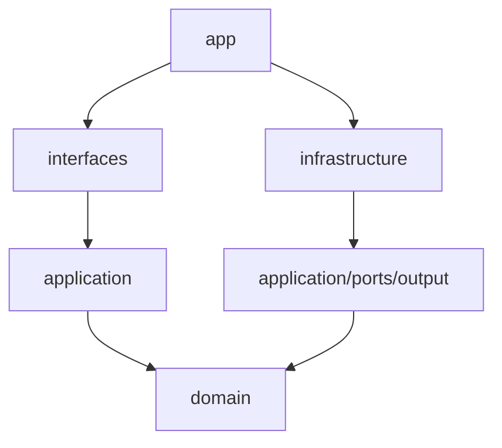

# Arquitetura

O `trading-core` segue Clean Architecture. A regra principal é manter domínio e aplicação independentes de frameworks, bancos e adapters concretos.

## Camadas

| Camada | Responsabilidade |
| --- | --- |
| `internal/domain` | Entidades, value objects, eventos, políticas de risco e state machines |
| `internal/application` | Casos de uso, portas, DTOs, comandos, queries e mappers |
| `internal/interfaces` | HTTP API, WebSocket e consumers inbound |
| `internal/infrastructure` | PostgreSQL, brokers, market data, LLM, quant fake, observabilidade |
| `internal/app` | Composição com Uber Fx e ciclo de vida dos processos |
| `cmd` | Entrypoints `api`, `worker` e `migrate` |

> [!note] Regra de dependência
> `domain` não conhece `application`, `interfaces`, `infrastructure` nem frameworks. Testes de arquitetura verificam essa regra via `go list -json`.

## Decisões centrais

- `interfaces` e `external` ficam separados para distinguir tráfego inbound e outbound.
- Existe uma única pasta `database` para pool, migrations, transações e repositories.
- Uber Fx fica confinado em `cmd`, `internal/app` e composição do módulo de banco.
- A outbox transacional protege eventos críticos de ordem/posição.
- O Quant Engine propõe sinais; ele não executa ordens.

## Onde aprofundar

| Assunto | Nota |
| --- | --- |
| Detalhe de API, eventos e banco | [[Índice - DLS]] |
| Origens de dados e sinais | [[Fontes de Dados]] |
| Modos de operação | [[Modos Operacionais]] |
| Histórico de decisões | [[09 - Decisões Arquiteturais]] |

## Notas relacionadas

- [[03 - Fluxo de Trading]]
- [[09 - Decisões Arquiteturais]]
- [[08 - Testes e Qualidade]]
