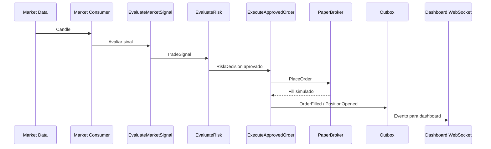

# Fluxo de Trading

O pipeline do modo PAPER começa com candles públicos da Binance Futures e termina em ordem simulada, posição aberta e eventos enviados ao dashboard.

## Sequência principal

1. `market.Consumer.HandleCandle` recebe candle.
2. `EvaluateMarketSignal` chama porta `QuantEngine`.
3. `TradeSignal` é persistido e publicado.
4. `EvaluateRisk` aplica política composta de risco.
5. `RiskDecision` é persistida.
6. `ExecuteApprovedOrder` cria ordem pendente, chama broker e registra fill.
7. Outbox persiste eventos críticos e worker republica eventos para consumidores.

> [!warning] Barreira de execução
> Nem LLM nem Quant Engine podem enviar ordem. Só `ExecuteApprovedOrder` chama `Broker.PlaceOrder`.

## Idempotência

- `ClientOrderID` deriva do `RiskDecisionID`.
- `IdempotencyRepository.Reserve` evita corrida de execução.
- Repositórios usam optimistic locking por `version`.
- Estado `Unknown` é usado quando broker pode ter aceitado ordem, mas resposta falhou.

## Relacionado

- [[Market Data Binance]]
- [[Quant Engine]]
- [[Contratos e Eventos]]
- [[06 - Segurança e Risco]]
- [[07 - API e Dashboard]]
