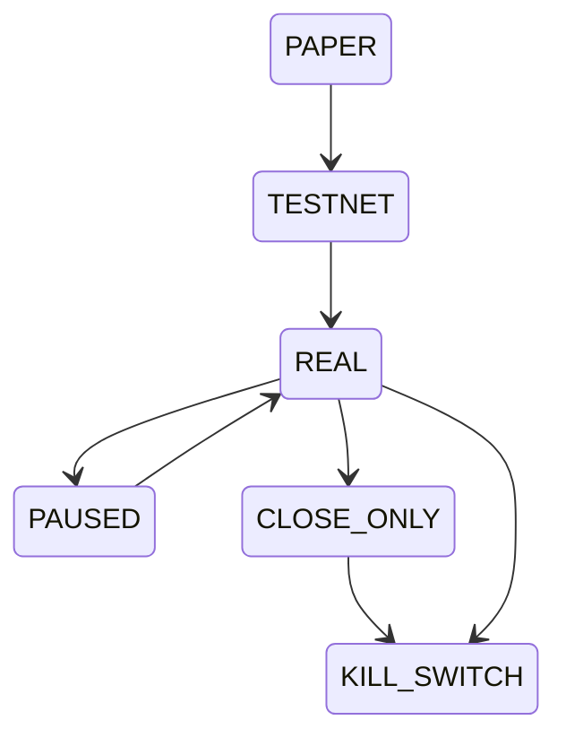

# Segurança e Risco

Aegis foi desenhado para reduzir risco operacional antes de qualquer contato com capital real.

> [!danger] Capital real
> Não use modo REAL sem validar PAPER, TESTNET, limites de risco, permissões da API key e reconciliação. O sistema cria guardrails; ele não decide que sua estratégia está pronta.

## Guardrails existentes

- Risk manager determinístico.
- State machine para modos operacionais.
- Kill switch.
- Modo REAL sem endpoint HTTP direto.
- Confirmação explícita para REAL via configuração.
- Execução idempotente por decisão de risco.
- Reconciliação de estado com broker.
- Incidentes para estados desconhecidos.

## Checklist antes de REAL

- [ ] Rodar PAPER por tempo suficiente.
- [ ] Validar Quant Engine real conectado.
- [ ] Revisar defaults em `internal/config/risk.go`.
- [ ] Rodar TESTNET com mesma estratégia.
- [ ] Confirmar que API key da Binance não possui permissão de saque.
- [ ] Ativar `BROKER_REAL_TRADING_ENABLED=true`.
- [ ] Definir `BROKER_REAL_TRADING_CONFIRMATION=I_UNDERSTAND_THE_RISK`.

## Modos operacionais

> [!note] Restrição importante
> `REAL` é protegido por validação de config, state machine de domínio e adapter real.

## Relacionado

- [[Modos Operacionais]]
- [[05 - Configuração]]
- [[Eventos de Mercado e LLM]]
- [[09 - Decisões Arquiteturais]]
