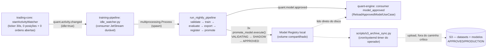

# Training Pipeline

Training Pipeline é a origem dos modelos de ML do Aegis: um serviço Python separado (`../training-pipeline`) que lê datasets Parquet já exportados pelo `quant-engine`, treina/valida/avalia modelos, detecta drift e exporta modelos ONNX + metadata para o Model Registry em filesystem que o `quant-engine` já sabe **ler**. Ele nunca opera trading, nunca fala com corretora, nunca recalcula indicadores de produção (RSI/EMA/ATR continuam domínio exclusivo do Rust) e **nunca promove automaticamente um modelo para produção** — só produz artefatos em disco.

> [!info] Status
> As 13 etapas planejadas estão completas: 21 casos de uso, 10 comandos de CLI, exportação ONNX com prova de extração cross-language contra o algoritmo real do Rust, Model Registry writer validado por um espelho Python do algoritmo de seleção do `quant-engine`, detecção de drift, presets Hydra de hiperparâmetros, e um teste de integração ponta a ponta cobrindo fixture → validar → split → treinar → avaliar → exportar → registrar → promover → verificar seleção pelo Rust. 282 testes (268 + 14 novos de integração da Fase 2, ver abaixo), ruff/black/mypy/import-linter limpos, `docker build` e `docker compose` verificados rodando de fato (não só buildando). Repositório próprio publicado em `https://github.com/Geovannisouza23/Training-pipeline`.
>
> **Fase 2 (26/07/2026): o gatilho automático de treino está implementado e validado ponta a ponta contra os três serviços reais** — ver seção própria abaixo. Isso fecha o gap "nenhuma integração cross-repo real ainda aconteceu" que esta nota registrava até esta atualização.

## Por que existe separado do `quant-engine`

Treinamento de ML precisa de um ecossistema (Pandas/Polars/DuckDB, scikit-learn, LightGBM, XGBoost, Optuna) que não faz sentido embutir no binário Rust de baixa latência que serve inferência em produção. A fronteira é a mesma família de decisão do ADR 0001 do `quant-engine` (que já separou trading-core de quant-engine): cada linguagem/runtime fica só com a responsabilidade que exige seu ecossistema.

## Arquitetura

Clean Architecture / Ports & Adapters / light DDD, mesmo estilo do `trading-core` (Go) e do `quant-engine` (Rust) — camadas enforced mecanicamente por `tests/architecture` (contrato `import-linter` + varredura de confinamento de env), não só por convenção. `domain` → `application` (21 casos de uso) → `interfaces` (CLI Typer) e `infrastructure` (adapters concretos), compostos em `src/app` (composition root). Ver `../training-pipeline/docs/architecture.md`.

Um único módulo (`src/domain/feature/feature_vector.py`) monta o vetor `[34]` float32 na ordem exata que o `quant-engine` espera — tanto o treino quanto a exportação ONNX importam esse mesmo módulo, para as duas pontas nunca divergirem silenciosamente na ordem das features.

## Contratos com o `quant-engine` (byte a byte, não só por convenção)

| Contrato | Onde | Risco se divergir |
| --- | --- | --- |
| Schema Parquet, 26 colunas, decimal-como-string | `../training-pipeline/docs/validation.md` | Leitura falha ou parseia lixo |
| 34 features, ordem fixa (`FeatureName::ALL`) | `../training-pipeline/docs/training.md` | Vetor ONNX com valores nas posições erradas |
| Tensor ONNX `[1, 34]` → saída única `success_probability` clampada `[0,1]` | `../training-pipeline/docs/onnx.md` | Modelo carrega mas retorna lixo silenciosamente — a superfície de maior risco do projeto |
| `metadata.json` (`model_name`, `version`, `state`, `feature_schema_version`, `artifact_filename`, `artifact_sha256`, `retired`) | `../training-pipeline/docs/model-registry.md` | `quant-engine` rejeita ou nunca carrega a versão |
| Versão lexicográfica (não semver), zero-padded | `../training-pipeline/docs/model-registry.md` | `find_active` do Rust escolhe a versão errada |

## Ciclo de vida do modelo — por que nunca promove sozinho

7 estados (`DRAFT → TRAINED → VALIDATING → SHADOW → APPROVED → PRODUCTION → RETIRED`), mas o loader do `quant-engine` só reconhece `APPROVED|CANARY|PRODUCTION` como carregável (case-insensitive). `CANARY` é a única exceção — o `quant-engine` reconhece, mas o spec de 7 estados deste projeto deliberadamente não implementa esse estado. Isso não é um detalhe cosmético: é o mecanismo real que garante "nunca promove para produção sozinho" — um modelo em qualquer um dos outros 5 estados é estruturalmente invisível para o `find_active` do Rust, independente de como o CLI for chamado. Ver [[Quant Engine]] para o lado que lê.

## Gatilho automático de treino — arquitetura híbrida (Fase 2, 26/07/2026)

Antes desta fase, treinar exigia rodar o CLI manualmente. Agora existe um loop fechado, disparado pelo próprio `trading-core` quando o sistema fica ocioso:

Decisão central (a arquitetura passou por duas versões descartadas antes desta — S3 como canal primário, depois só volume local sem S3 — até chegar neste desenho híbrido definitivo):

- **Volume local compartilhado é o caminho crítico**: leitura/escrita de dataset, treino, Model Registry operacional, carregamento pelo `quant-engine` — zero dependência de rede durante o treino. Os `docker-compose.yml` dos três repos agora montam o mesmo caminho host (`../shared-data/{datasets,model-registry}`, bind mount, não volume nomeado) — este era um gap real corrigido nesta fase (ver [[10 - Backlog e Lacunas]]).
- **S3 é durabilidade, fora do caminho crítico**: backup de dataset, histórico de modelo `APPROVED`/`PRODUCTION`, recuperação de desastre. Um script totalmente separado (`scripts/s3_archive_sync.py`) faz duas varreduras idempotentes (dataset com `_SUCCESS`; modelo com `state in {APPROVED, PRODUCTION}`) e sobe pro S3 — nunca é chamado pelo `idle_watcher.py`, por instrução explícita: um S3 lento ou fora do ar nunca pode atrasar ou falhar um treino.

### Três componentes novos

| Componente | Responsabilidade |
| --- | --- |
| `src/app/nightly_pipeline.py` | `run_nightly_pipeline` — a sequência completa (validar → treinar → avaliar contra `roc_auc_threshold` → exportar ONNX → registrar → promover 3x até `APPROVED`) e, só em caso de sucesso, publica `quant.model.approved` via `nats-py` (JetStream, com dedup por `Nats-Msg-Id`) |
| `scripts/idle_watcher.py` | Serviço de vida longa com escopo deliberadamente restrito a 4 responsabilidades: consumir `quant.activity.changed`; `idle=true` → iniciar treino (se nada já rodando); `idle=false` em treino → terminar graciosamente; nunca permitir duas execuções concorrentes. Roda o treino em `multiprocessing.Process` (contexto `spawn`, não thread nem subprocess) para poder mandar um sinal de término limpo |
| `scripts/s3_archive_sync.py` | Processo totalmente separado, sem relação com o `idle_watcher.py` — sync de durabilidade, rodado manualmente ou por cron/systemd timer do operador |

> [!note] "Shadow mode" do pedido original
> O ciclo de 7 estados do `training-pipeline` não tem `CANARY` (ver "Ciclo de vida do modelo" acima); a promoção sempre passa por `SHADOW` a caminho de `APPROVED`, mas o `quant-engine` não reconhece `SHADOW` como carregável. Resolvido como: "carregar em shadow mode" = modelo em `APPROVED` (carregável, mas não `PRODUCTION`) — consistente com a regra existente de nunca promover sozinho até produção.

### Validado com um smoke test real de 3 serviços, não só testes automatizados

Os três `docker-compose.yml` (`trading-core`, `quant-engine`, `training-pipeline`) foram subidos juntos de verdade (rede `aegis-net` compartilhada, volume `../shared-data` alinhado), com um dataset sintético semeado via o próprio fixture writer da suíte de testes. O `trading-core` (banco novo, modo PAPER, zero posições) publicou `quant.activity.changed` das duas binárias (`api` e `worker`) — o `idle_watcher.py` treinou na primeira mensagem e corretamente ignorou a segunda (`idle_watcher_training_already_running`), provando o guard de concorrência sob condição real, não só em teste isolado. O modelo chegou a `APPROVED` no registry compartilhado, o consumer `model_approved` do `quant-engine` confirmou o reload (avanço limpo do `ack_floor` do JetStream, sem erro — o handler só faz ack em `Ok(())`), e `s3_archive_sync.py` arquivou dataset + modelo num MinIO real, com reexecução comprovadamente idempotente.

Esse smoke test achou e corrigiu 2 bugs reais que nenhum teste automatizado (unitário ou Testcontainers isolado) tinha capturado:

1. **Subject NATS incompatível com o stream real**: o subject escolhido (`trading.activity.changed`) não batia com o filtro do stream `QUANT_EVENTS` (`quant.>`) que os dois serviços já compartilham por padrão — publish falhava silenciosamente com "no response from stream". Corrigido renomeando para `quant.activity.changed` (mesmo prefixo que `quant.decision.outcome.received`/`quant.model.approved` já usam, pelo mesmo motivo). Ver [[Contratos e Eventos]].
2. **Imagem Docker do `watcher` não continha `scripts/`**: o `Dockerfile` só copiava `src`/`configs` pro estágio de runtime. Corrigido com `COPY scripts ./scripts` — e o entrypoint precisou virar `python -m scripts.idle_watcher` (não `python scripts/idle_watcher.py`), porque `-m` resolve `import src...` via `WORKDIR` em vez do diretório do próprio script.

> [!warning] O que ainda não foi provado
> O smoke test treinou contra um dataset **sintético** (gerado pelo fixture writer da suíte, mesmo schema/layout de um export real) — ainda não existe uma execução do loop completo contra um dataset genuinamente exportado pelo `quant-engine` a partir de dados de mercado reais. Ver [[10 - Backlog e Lacunas]].

## CLI (Typer, `src/interfaces/cli/main.py`)

`train, evaluate, walk-forward, optimize, export, validate, compare, drift, promote, archive` — 10 comandos, cada um recebendo a `Application` já montada via `ctx.obj` do Typer (injetada por `src/app/main.py`), nunca construindo um adapter concreto diretamente.

## Stack

Python 3.13, Poetry, Pandas/Polars/PyArrow/DuckDB (dataset), scikit-learn/LightGBM/XGBoost (treino), ONNX/skl2onnx/onnxmltools (exportação), Optuna (busca de hiperparâmetros via walk-forward, nunca split aleatório), MLflow (adapter opcional — `noop` é o padrão, suíte não depende de `mlflow` instalado), Pydantic v2 + Hydra (config e presets de hiperparâmetro), Typer (CLI), Loguru/Structlog/Prometheus/OpenTelemetry (observabilidade), Pytest/Hypothesis (testes, incluindo propriedades como ordenação lexicográfica de versão e ausência de leakage temporal).

## Documentação própria do serviço

O repo `../training-pipeline` mantém sua própria documentação técnica (não duplicada aqui):

| Assunto | Nota |
| --- | --- |
| Camadas, os 21 casos de uso, guard rails | `../training-pipeline/docs/architecture.md` |
| Modelos treináveis, feature selection, HPO, Hydra | `../training-pipeline/docs/training.md` |
| As 3 validações (dataset/feature/label) e o gap de labels | `../training-pipeline/docs/validation.md` |
| PSI, teste KS, feature/prediction/label drift | `../training-pipeline/docs/drift.md` |
| Contrato ONNX, conversão, graph surgery, prova cross-language | `../training-pipeline/docs/onnx.md` |
| Layout do registry, versão lexicográfica, o gap do CANARY | `../training-pipeline/docs/model-registry.md` |
| Split temporal e walk-forward, por que nunca é split aleatório | `../training-pipeline/docs/walk-forward.md` |
| CI (ruff, black, mypy, import-linter, pytest, hypothesis, build, docker) | `../training-pipeline/.github/workflows/ci.yml` |

## Gaps conhecidos

> [!success] Resolvido (26/07/2026): labels reais já chegam do `quant-engine`
> O `quant-engine` ganhou `LabelPendingDecisionsUseCase` (poll em background, `app::lifecycle`) — calcula `OutcomeLabel` assim que o horizonte forward-looking de um `TrainingRecord` tem candle history suficiente atrás dele (`domain::services::label_calculator`, implementado e testado antes, mas nunca chamado em produção até esta correção). Datasets exportados agora saem com `label_version`/`profitable_trade`/`net_return`/`forward_return_n_candles` reais, não `NULL`. `ValidateLabelSchema` continua existindo para o caso de dataset ainda não rotulado (ex. horizonte não coberto por candle history), não é mais o caminho normal.

> [!success] Resolvido (26/07/2026): volumes compartilhados por padrão
> Os `docker-compose.yml` dos dois repos agora montam o mesmo caminho host por padrão (`../shared-data/{datasets,model-registry}`, bind mount) — o `quant-engine` usava volume nomeado (isolado ao próprio projeto compose) até esta correção, o que tornava o compartilhamento impossível independente de configuração de operador. `registry_root`/`export_root_dir` continuam desacoplados por padrão apenas no cenário não-Docker (`.env` local) — ver [[10 - Backlog e Lacunas]].

- `CANARY` fora de escopo (ver acima) — decisão deliberada, não esquecimento.
- Sem ADRs próprias ainda — diferente de `trading-core` e `quant-engine`, o `training-pipeline` não tem `docs/decisions/` preenchido (pasta existe, vazia). Ver [[09 - Decisões Arquiteturais]].
- O smoke test da Fase 2 (ver seção acima) treinou contra dataset sintético, não um export real do `quant-engine` a partir de mercado ao vivo — ver [[10 - Backlog e Lacunas]].
- `s3_archive_sync.py` depende de um cron/systemd timer configurado manualmente pelo operador — não há agendamento automático, nem runbook publicado ainda.

## Relacionado

- [[Quant Engine]]
- [[Contratos e Eventos]]
- [[10 - Backlog e Lacunas]]
- [[09 - Decisões Arquiteturais]]
- [[03 - Fluxo de Trading]]
