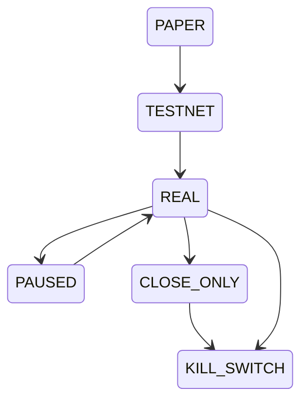

# Modos Operacionais

Modos operacionais controlam onde o sistema pode executar e quais ações são permitidas.

## Modos

| Modo | Finalidade |
| --- | --- |
| `PAPER` | Simulação local sem capital real |
| `TESTNET` | Integração com Binance Futures testnet |
| `REAL` | Execução com capital real e múltiplas travas |
| `PAUSED` | Pausa ações operacionais |
| `CLOSE_ONLY` | Permite apenas redução/fechamento |
| `KILL_SWITCH` | Estado terminal de bloqueio operacional |

## Gatilhos de segurança

- `REAL` não tem endpoint HTTP direto.
- `BROKER_REAL_TRADING_ENABLED=true` é obrigatório para REAL.
- `BROKER_REAL_TRADING_CONFIRMATION=I_UNDERSTAND_THE_RISK` é obrigatório para REAL.
- Adapter real recusa inicialização sem confirmação.
- Reconciliação roda em todos os modos.

## Relacionado

- [[06 - Segurança e Risco]]
- [[05 - Configuração]]
- [[07 - API e Dashboard]]
